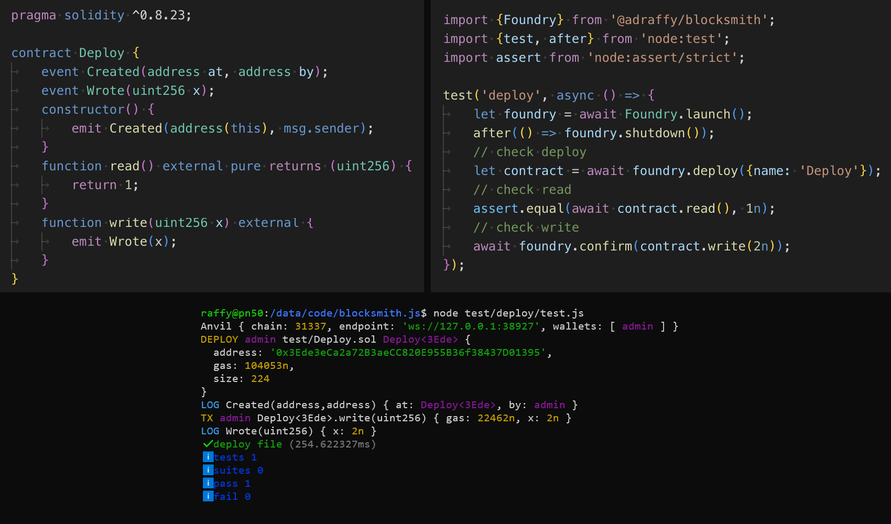

# blocksmith.js

⚠️ This repo is under active development!

`npm i @adraffy/blocksmith`

* see [**types**](./dist/index.d.ts) / designed for [Foundry](https://github.com/foundry-rs/foundry) + [ethers](https://github.com/ethers-io/ethers.js).
* compatible with any async test runner, including [node:test](https://nodejs.org/api/test.html)
* designed for complex [EIP-3668](https://eips.ethereum.org/EIPS/eip-3668) contracts

### Instructions

1. [`foundryup`](https://book.getfoundry.sh/getting-started/installation)
1. `npm i`
1. `npm run start` &rarr; runs deploy example: [`js`](./test/deploy/test.js) + [`sol`](./test/Deploy.sol)

### Examples

* [test/deploy](./test/deploy/)
* [test/ens-encoded-dns](./test/ens-encoded-dns/)
* [resolverworks/**TheOffchainResolver.sol**](https://github.com/resolverworks/TheOffchainResolver.sol/blob/main/test/test.js)
* [resolverworks/**XCTENS.sol**](https://github.com/resolverworks/XCTENS.sol/blob/main/test/test.js)

### Additional Tooling

* [`Node`](./src/Node.js) is client-side scaffolding to manage name/label/namehash/labelhash which simplifies many ENS-related functions that require a variety of inputs.
* [`Resolver`](./src/Resolver.js) is a [**TOR**](https://github.com/resolverworks/TheOffchainResolver.sol)-aware [ENSIP-10](https://docs.ens.domains/ensip/10) resolver implementation.
